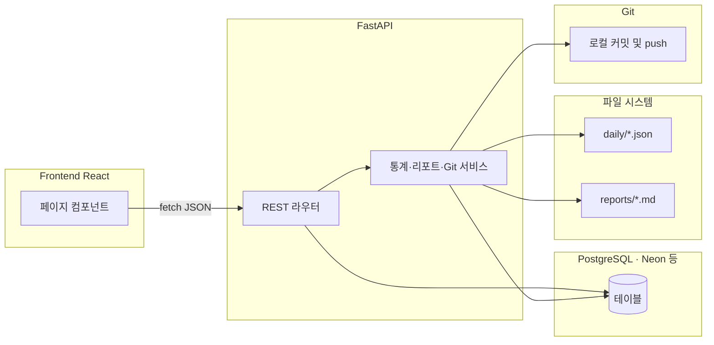

# 아키텍처 개요

이 저장소는 **일간 계획·주간 통계·목표·수면 기록·성취도 요약·Git 로그 커밋**을 하나의 워크플로로 묶습니다.

## 데이터 흐름

1. **프런트엔드**는 Vite 개발 서버에서 실행되며, API 호출은 동일 출처로 보이도록 프록시를 통해 FastAPI로 전달됩니다.
2. **FastAPI**는 SQLAlchemy 세션으로 PostgreSQL을 읽고 씁니다. 프로덕션·로컬 모두 코드는 동일하고, Neon 같은 **호스티드 Postgres**에 두면 로컬 DB 설치 없이 `DATABASE_URL`만으로 연결할 수 있습니다.
3. **리포트 서비스**는 저장된 일간 계획을 바탕으로 `daily/YYYY-MM-DD.json`과 `reports/YYYY-MM-DD-report.md`를 생성합니다.
4. **Git 서비스**(또는 `scripts/git_auto_commit.py`)는 위 파일만 스테이징하고 커밋한 뒤 `origin`의 설정된 브랜치로 push합니다. 결과는 `git_commit_logs` 테이블에 성공/실패로 기록됩니다.

## 설계 선택 요약

- **가중 성취율**을 `daily_plans.achievement_rate`의 주 지표로 사용합니다. 단순 완료 비율은 `total_score`에 반영합니다.
- Git 작업 실패 시 예외를 던져 API 전체를 중단하지 않고, DB 로그와 HTTP 응답으로 원인을 남깁니다.
- 향후 **GitHub API** 기반 업로드는 토큰을 환경 변수로만 주입하고, 저장소 내에 커밋하지 않는 것을 전제로 확장할 수 있습니다.
